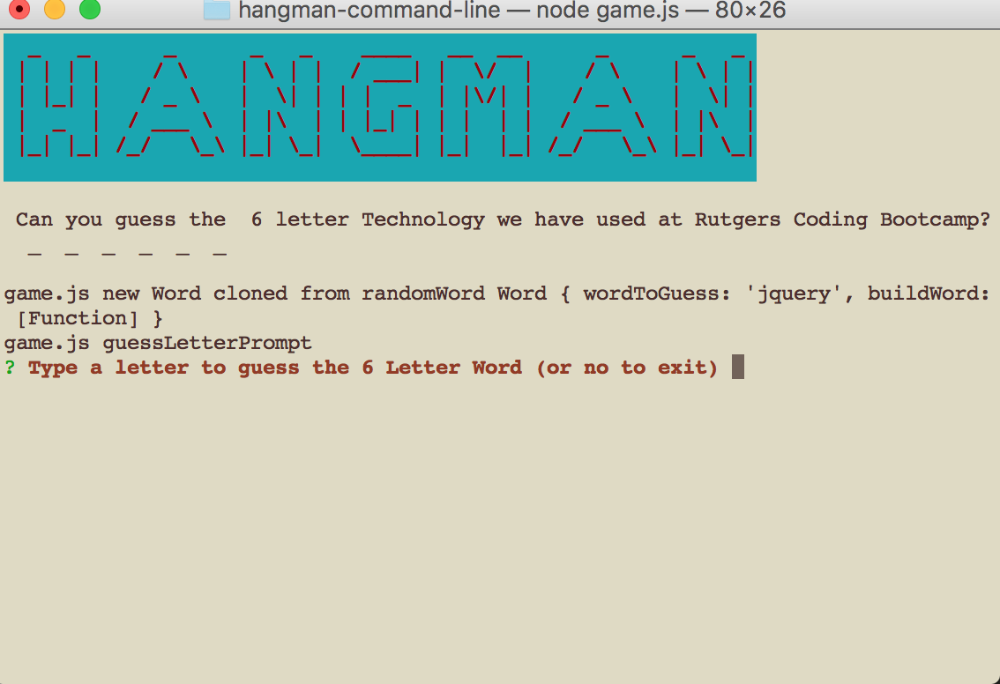

hangman-command-line
# Hangman from the command line
This node Hangman Game uses inquirer to prompt user for letter input, it uses constructors which are used to create a new object without creating redundancies while coding.  
The app pics a random word from a word list and the number of letters is displayed. The player is then prompted to enter a letter then the letter guessed is verified against random word. Letters are displayed with '_ o _ _' and replaced with correct guesses.

## What it looks like:

## Technologies Used: 
- JavaScript 
- node.js 
- npm modules used: 
**inquirer** used to prompt user and get input response
**chalk** used to change background color
**clear** used to have the ability to clear the screen
**figlet** used to create big graphic "HANGMAN" Logo letters

## Built With:
* Sublime Text

## Links: 	
- https://ivonnek.github.io/hangman-command-line/
- https://github.com/IvonneK/hangman-command-line 

## Author: 
**Ivonne Komis** 
Member: Rutgers Coding Bootcamp
