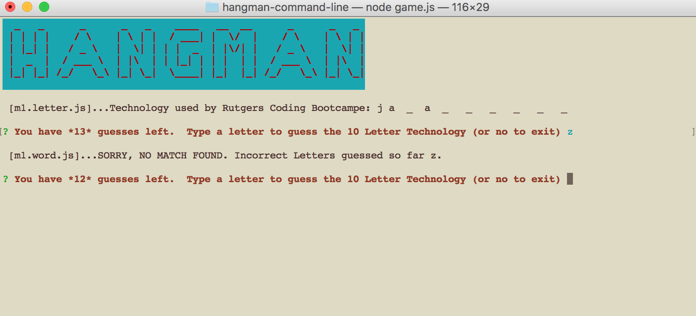

hangman-command-line
# Hangman from the command line
This app is a node Hangman command line app.  It uses JavaScript, npm inquirer, chalk, clear, figlet and say. It requires 2 constructor files (word.js and letter.js). Constructors are used to create a new object without creating redundancies (I call it cloning).  
The app picks a random word from a word list then displays the number of letters with a description of type of word. The player is then prompted to enter a letter and also displays the number of guess they have. The number of letters are displayed with underscores  '_ o _ _' then underscores are replaced with correct letter until all letters are guessed. If the player guess all letter the app displays a new figlet with the word in it. 
**youWin function uses the 'say'. To listen to audio it must be unmuted.**

## What it looks like:

## Technologies Used: 
- JavaScript 
- node.js 
- npm modules used: 
**inquirer** used to prompt user for input 
**chalk** used to change text and background colors 
**clear** used to have the ability to clear the screen 
**figlet** used to create graphic "HANGMAN" Logo letters and to display the word at the end.
**say** used to use audio to tell player they won.

## Built With:
* Sublime Text

## Links: 	
- https://ivonnek.github.io/hangman-command-line/ 
- https://github.com/IvonneK/hangman-command-line/

## Author: 
**Ivonne Komis** 
Member: Rutgers Coding Bootcamp
